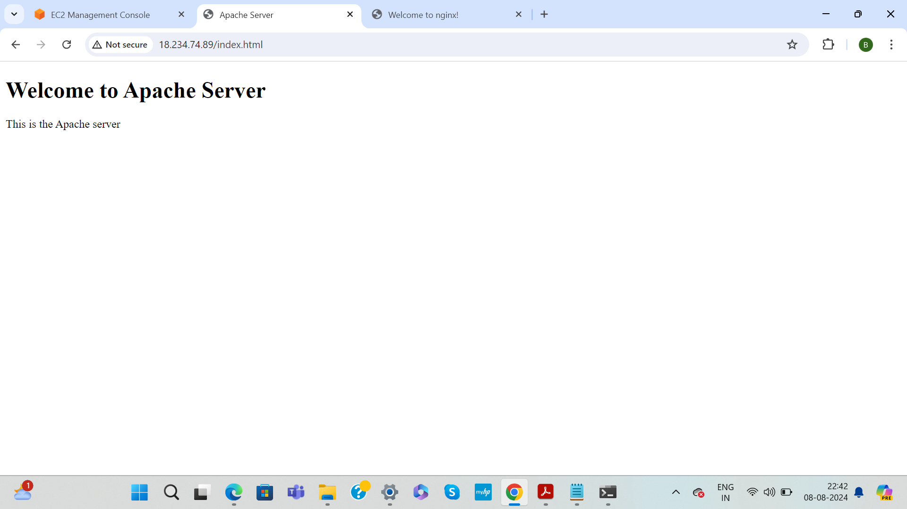

# Ansible Configuration Management for Apache and Nginx

This project uses Ansible roles to configure Apache and Nginx servers. The roles handle the installation, service management, and deployment of HTML files that display server information.

## Project Structure

The file structure in this repository will be same in Ansible Controller server 
(pwd -> home/ubuntu)


- `ansible.cfg` - Configuration file from the ansible installation
- `roles/` - Contains the Ansible roles for Apache and Nginx.
- `hosts` - Inventory file listing Apache and Nginx servers.
- `playbook.yml` - The main playbook to run all roles and tasks.

## Screenshots
Below are the screenshots of the solution:
- **Server List**:
  
- **Playbook Execution**:
  
  
  
- **Status check on Apache Server**:
  
  - **Status check on Nginx Server**:
  
- **HTML Deploy on Apache Server**:
  
- **HTML Deploy on Nginx Server**:
  

## Usage

1. Clone the repository.
2. Update the `hosts` file with your server IPs.
3. Run the playbook:

   ```bash
   ansible-playbook -i hosts playbook.yml

## Tasks

- Install Apache/Nginx
- Start the Apache/Nginx service
- Install Java on the Apache and Nginx servers.
- Deploy an HTML file with server information
- Display a post-installation message
